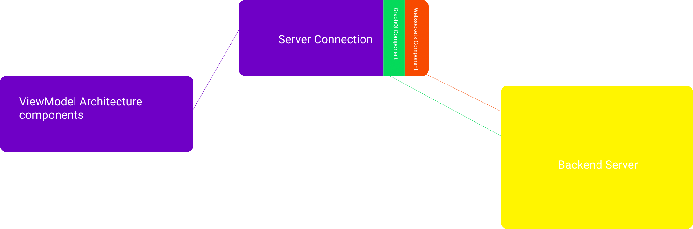

## 4. Backend communication 

The application's main purpose is to aid the waiters in keeping track of their orders, bills and ultimately their customers. To achieve this, the application requires a degree of synchronicity with the webserver, which is achieved through the network communication layer.
 
## 4.1 Simple requests
 
For simple, short requests to the server, the application uses [GraphQL](https://graphql.org/), more specifically [Apollo GraphQL Android](https://www.apollographql.com/docs/android/). This enables us to easily deal with simple CRUD operations.
 
Such calls are being made everytime the user chooses to update, create or remove a table or any of its orders. As well as in a select few situations, when the application itself requires more data from the server, to facilitate its internal operations.
 
## 4.2 Mirroring
 
Tasks such as screen mirroring require a higher degree of cohesion with the webserver, as well as faster, event-driven updates. To tackle these issues we have used websockets, implemented using [okHttp](https://square.github.io/okhttp/). 
 
This allows us to sync the data received by the server, from the restaurant's clients, to the data of the application's user and thus allows for smooth and transparent communication between the parties involved.

## 4.3 Serialization and DeSerialization

To serialize and deserialize the data given to and received from the server, the layer makes use of the [gson library](https://github.com/google/gson).
