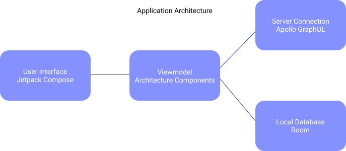

## 3. Technologies used

### 3.1. Platform
The mobile application is built on the [Android](https://www.android.com/) platform and can run on devices with [Android 5 Lollipop](https://www.android.com/versions/lollipop-5-0/) and higher.

### 3.2. Development environment
For packaging and development of the application, [Android Studio](https://developer.android.com/studio) was used in conjuncture with various [Android Emulators](https://developer.android.com/studio/run/emulator) for testing.

### 3.3. Programming language
The programming language used in the project is [Kotlin](https://kotlinlang.org/), the official programming language for Android. All components were integrated using [Kotlin Coroutines](https://kotlinlang.org/docs/reference/coroutines-overview.html) for asynchronous code execution.

### 3.4. User interface
The user interface was build with [Jetpack Compose](https://developer.android.com/jetpack/compose) and following _some_ of the [Material Design guidelines](https://material.io/design/guidelines-overview).

### 3.5. Architecture
The general architecture of the project follows [MVVM](https://en.wikipedia.org/wiki/Model%E2%80%93view%E2%80%93viewmodel) and [Reactive programming](https://en.wikipedia.org/wiki/Reactive_programming) patterns, achieved with [Android Architecture Components](https://developer.android.com/jetpack/guide) and [Kotlin Flows](https://developer.android.com/kotlin/flow).

### 3.6. Local storage
While offline, data is stored locally in the application using the [Room database](https://developer.android.com/jetpack/androidx/releases/room)

### 3.7. Network communication
For network communication with the [GraphQL](https://graphql.org/) server, [Apollo GraphQL](https://www.apollographql.com/) was used, specifically the [Android version](https://www.apollographql.com/docs/android/)

### 3.8. Testing
For automated testing, [JUnit5](https://junit.org/junit5/) and [Espresso](https://developer.android.com/training/testing/espresso) were used.
