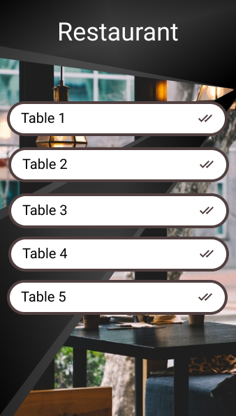
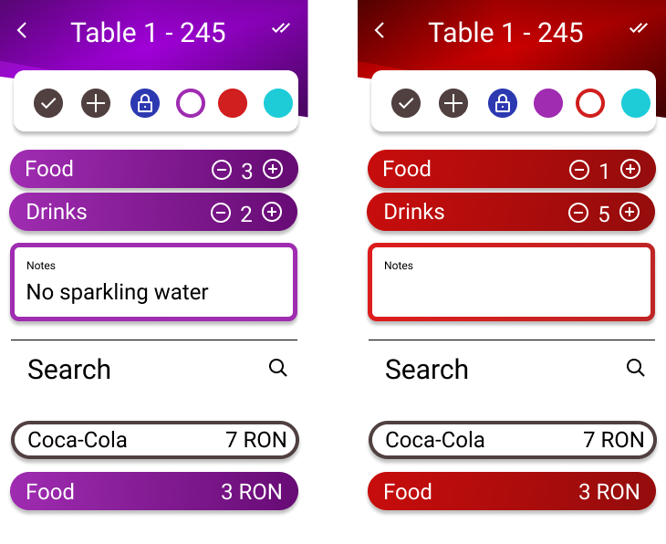
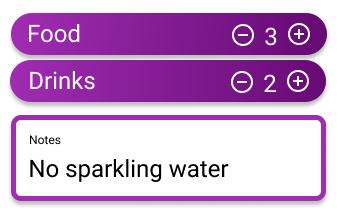
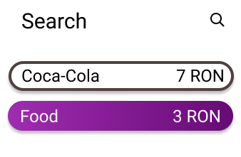

# 2. User Interface - Usage Guide

The application opens with a screen containing the list of **Tables** in your restaurant.

## 2.1 Tables Screen

The tables are listed with their names and an tick image that indicates if the waiter is called at the table.

---

Waiters can select a table by pressing on it and see its orders in the **Orders** screen.

## 2.2 Orders Screen

In this screen, the waiter can manage the **Orders** for a specific **Table**.

---

At the top of the **Orders** screen one can see the name, unique code of the selected **Table** and the call indicator.
A horizontal menu can be found directly underneath it.

---

Each customer is uniquely represented by a color and can be creating using the button with the **+** sign.

The default selection is the **All Orders** screen and it's the leftmost button in the menu.
In this screen, all the item types ordered by the customers are displayed.
In the right side of each one you can find the total number of orders for each item type. 
Once expanded by pressing on an item type, the number of items for each customer is also available.

At the bottom of the page, the waiter can see all notes for each customer.

---

To manage an order for any specific customer, simply select their respective color circle from the top of the screen.

---

The items that the customer ordered are listed in this section, where one can easily increase their number using the "+" and "-" buttons.
Below the items, specific notes for a customer can be added.  

---

To find an item from the menu, simply scroll through the menu at the bottom, or use the search bar.
To select an item and add it to the current order of the selected customer, press on it.

