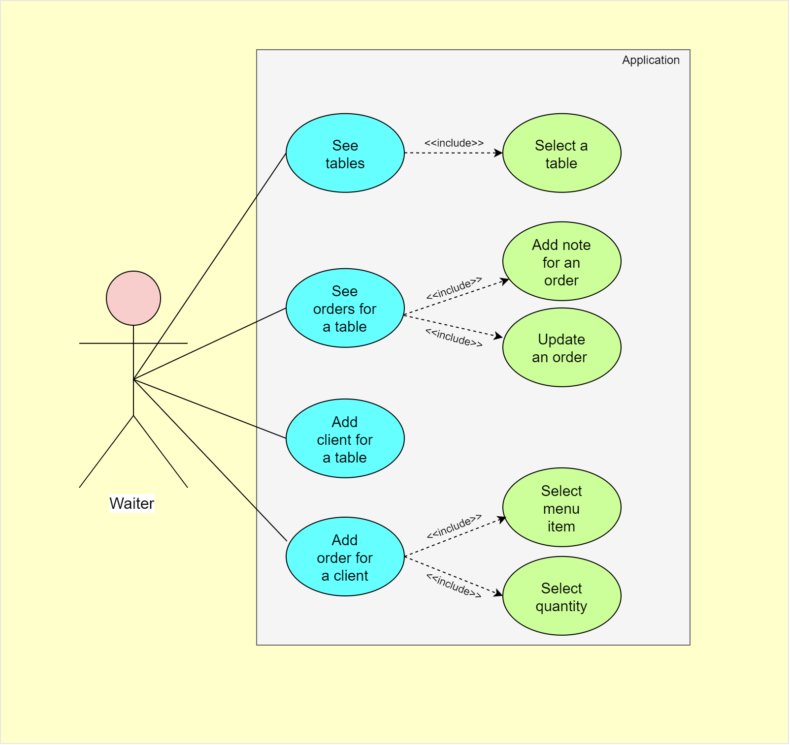

## 14. Use Cases

### 14.1. General
The application is built for the waiters in order to ease their work. In stead of using a paper or a notebook, they can use this app for orders and live-time actions.
The waiter can see all the tables, all clients with their orders for a certain table, add notes to orders etc. All these actions are described more concise below.

### 14.2. Table Screen
When no table is selected, the app is listing all the tables in the restaurant. The waiter is able to click on a table, to see the information about a table.

### 14.3. Order Screen
When a table is clicked, a new screen is opened, with all the information about the table. The screen contains the code of the table, the clients for this table, each one
assigned with a color (at most 6 clients per table), and all the orders for each client together with some notes if needed, which can be seen if the waiter click on a certain client.
